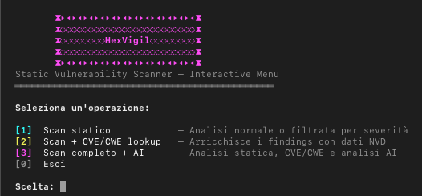

## usage

chmod +x vulnscan.sh

./vulnscan.sh easy user interactive menu

[1] Static scan — normal or severity-filtered analysis

[2] Scan + CVE/CWE lookup — enriches findings with NVD data

[3] Full Scan + AI — contextual analysis, reduces false positives

Requires API key in ai_analysis.py → API_KEYS { "groq": "gsk_..." }

## direct scan

python main.py <path>

python main.py file.c -v 

python main.py folder/ --severity HIGH 

python main.py folder/ --lang c 

python main.py folder/ --lang python 

python main.py folder/ --no-banner 

## supported extensions

 --lang c --lang python --lang js --lang rust --lang java
.c .cpp .h .hpp · .py · .js .ts .mjs · .rs · .java .kt

